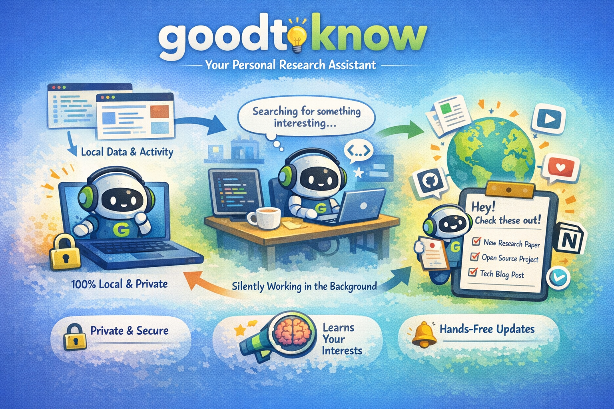

<div align="center">

# GoodToKnow

**一个 Local-first 的信息发现 Agent：它能结合你当前的工作上下文，为你生成一份“你现在最需要知道什么”的简短 Briefing，并在日常使用中与你共同进化。**

[English](README.md)

[](#快速开始)
[](#goodtoknow-是什么)
[](#它是如何工作的)
[](#配置)


</div>

## 10 秒理解 GoodToKnow

你是否经常觉得，“我好像错过了一些对当前工作很有价值的信息”？如果答案是肯定的，那么GoodToKnow就是为你设计的。

它运行在本地，通过读取你的工作上下文并搜索网络上的相关信息，最终为你提炼出一份短小精悍的 Briefing，而不是硬塞给你一个刷不到头的信息流（Feed）。

你可以把它当作一个安静的“侦察兵”，始终紧贴你的实际工作，默默帮你留意周遭的价值资讯。

## 安装方式

### 推荐：通过 PyPI 安装

GoodToKnow 现在以 PyPI 上发布的 `goodtoknow-gtn` 包作为正式安装入口。推荐用户路径是：

```bash
uv pip install goodtoknow-gtn
gtn setup
```

现在 `gtn setup` 会直接在 CLI 内完成首次引导：

- 在 `~/.gtn` 下初始化 GTN runtime
- 交互式询问可选的 Notion 输出配置
- 交互式询问可选的初始用户 profile

如果 `pip install` 之后你的环境里还没有 `gtn` 命令，就需要直接通过该 Python 环境运行，或者把该环境的脚本目录加入 `PATH`。

### 从源码安装

如果你是要测试本地改动，或者直接从源码开发 GoodToKnow，可以这样：

```bash
git clone https://github.com/qzzqzzb/good-to-know.git
cd good-to-know
uv build
uv pip install --upgrade --force-reinstall dist/goodtoknow_gtn-*.whl
gtn setup
```

如果你想放进一个单独的本地虚拟环境里开发：

```bash
uv venv .venv
source .venv/bin/activate
uv pip install --upgrade --force-reinstall dist/goodtoknow_gtn-*.whl
gtn setup
```

## GoodToKnow 是什么

GoodToKnow 面向这样一类人：你觉得自己可能正错过某些有价值的事物——比如新工具、新论文、动态更新、灵感启发，或是与当前工作紧密相关的潜在机会——但你绝对不想再多安装一个喧闹的信息流产品。

它会安静地在后台运行，基于你的本地上下文向外探索，只把极少数真正值得你关注的内容带回来。

它会收集诸如浏览器历史、Agent 工作片段等本地信号，并利用这些信号对最终推荐的内容进行精准过滤。

<p align="center">
  
</p>

你可能会需要它的原因：

- **静默运行**  
  它的设计目标是在后台运行，而不是反复要求你管理它。

- **Local-first 隐私**  
  你的个人上下文默认保留在本机，系统可以从你的活动中学习但绝不会把任何信息外泄。

- **推荐会越来越贴合你**  
  随着你不断使用、提供反馈、并让它观察更多上下文，它会逐步推荐更适合你的内容。

- **它提供的是 briefing，不是 feed**  
  目标不是把所有东西都展示给你，而是帮助你注意到“你现在大概率应该知道的那几件事”。

- **和真实工作相连**  
  它不是做泛泛的内容发现，而是尽量把推荐结果和你正在构建、阅读、思考的事情连接起来。

## 快速开始

### 前置条件

目前你需要：

- macOS
- `uv`
- 一个已经能正常登录和认证的本地 Codex 环境

可选但推荐：

- 如果你想把结果输出到 Notion，需要可用的 Notion MCP / 认证

### 运行

立即运行一次：

```bash
gtn run
```

查看当前调度器 / runtime 状态：

```bash
gtn status
```

设置周期性运行：

```bash
gtn freq 1h
```

停止未来的周期性运行：

```bash
gtn stop
```

通过 PyPI 升级 GTN：

```bash
uv pip install --python ~/.gtn/.venv/bin/python --upgrade goodtoknow-gtn
```

如果你想卸载 GTN 这个包本身：

```bash
uv pip uninstall goodtoknow-gtn
```

## 它是如何工作的

GoodToKnow 当前是一个分层的本地系统：

1. `context`
   - 收集本地信号，例如浏览器历史和 coding agent 工作记录
2. `memory`
   - 在本地 memory runtime 中存储规范化后的用户上下文、外部发现和反馈信号
3. `discovery`
   - 基于当前 memory，使用带 web search 的 Codex 向外探索
4. `runtime`
   - 负责协调整个循环
5. `output`
   - 把推荐结果发布到外部载体，例如 Notion

当前启用的 stack 由 `bootstrap/stack.yaml` 选择。

默认 stack 目前使用的是：

- `context/naive-context`
- `memory/mempalace-memory`
- `discovery/web-discovery`
- `runtime/codex-agent-loop`
- `output/notion-briefing`

## GTN 目前会扫描哪些用户上下文

当前默认的 context stack 是刻意做窄、并且偏本地优先的。GTN 并不会尝试“把你机器上的一切都读一遍”。默认实现目前只读取少量、和“你最近在做什么”强相关的本地信号。

### 1. 最近的浏览器历史

只要本地历史数据库存在，GTN 目前会读取这些浏览器的最近访问记录：

- Chrome
- Edge
- Brave
- Firefox

它从浏览器历史里提取的信息主要是：

- 页面 URL
- 页面标题（如果有）
- 最近访问时间
- 浏览器来源（`chrome`、`edge`、`brave`、`firefox`）

在写入 memory 之前，GTN 会先做一层规范化：

- 忽略浏览器内部页面，例如 `chrome://`、`edge://`、`brave://`、`about:`、`file://`
- 只保留普通的 `http` / `https` 页面
- 去掉常见追踪参数，例如 `utm_*`、`fbclid`、`gclid` 等
- 按“浏览器 + 规范化 URL”去重，只保留最近一次访问
- 最终转换成紧凑的 `user_signal` 观察项，而不是把原始数据库记录整块塞进 memory

默认浏览器历史采集范围：

- 回看窗口：最近 72 小时
- 每次采集最多保留：20 条观察

一个重要限制：

- GTN 目前把浏览器历史当作“你最近碰过什么网页”的信号
- 它**不会**直接从浏览器历史数据库里提取完整网页正文

### 2. 最近的 coding-agent 会话活动

GTN 还会读取本地 coding agent 的最近会话日志，目前包括：

- `~/.codex/sessions` 下的 Codex 会话日志
- `~/.claude/projects` 和 `~/.claude_bak/projects` 下的 Claude 会话日志

目标不是把整段对话全文塞进 memory，而是提取“发生过哪些具体工作片段”的紧凑观察。

对 Codex，会重点识别：

- 高信号的用户请求
- `apply_patch` 类型的编辑
- 具有写入性质的 `exec_command`，比如文件重定向、写文件、移动文件、`mkdir`、`touch` 等

对 Claude，会重点识别：

- 高信号的用户请求
- `Write`、`Edit`、`MultiEdit` 这类写文件工具
- 具有写入性质的 `Bash` 命令

GTN 如何把 agent 历史转成上下文：

- 优先保留“编辑片段（edit episodes）”，而不是整场 session 的笼统摘要
- 一场很长的 session，如果明显分成多个实现片段，可能会拆成多条观察
- 每条观察会尽量保留：
  - 来源 agent（`codex` 或 `claude`）
  - 所在工作目录 / cwd
  - 能推断出的被修改文件或目标路径
  - 一个基于用户请求生成的简短锚点摘要

默认 agent 会话采集范围：

- 回看窗口：最近 168 小时
- 每次采集最多保留：16 条观察
- 每个 session 最多保留：3 条观察
- Codex subagent session：默认不纳入
- 非编辑型 session：如果没有明确编辑片段，默认仍可保留为简短摘要

一个重要限制：

- 当前 agent-session ingest 是刻意做“有损压缩”的
- 它保留的是工作片段摘要，不是完整 transcript 回放

### 3. 这些上下文最终会流向哪里

默认 context skill 会先把规范化后的观察写到：

- `context/naive-context/outbox.md`

然后再由当前 memory 层 ingest 进去。它会影响的主要是：

- GTN 下一轮向外搜索什么主题
- 哪些发现更像“和你现在相关”
- 最终 briefing 的排序优先级

### 4. 默认情况下，GTN 目前**不会**扫描什么

在当前默认 stack 里，GTN **不会**去广泛扫描你机器上的任意个人数据。比如，这个仓库的默认 context skill 目前不会默认 ingest：

- 邮件
- 聊天记录
- 任意本地文档
- 剪贴板历史
- 通用意义上的终端滚动历史
- 浏览器页面全文内容

后面这些边界当然可能演进，但当前默认实现其实很克制：主要就是“最近浏览器历史 + 最近 coding-agent 工作历史”。

## 配置

### Notion 输出

Notion output skill 的配置文件在：

```text
~/.gtn/runtime/GoodToKnow/output/notion-briefing/settings.json
```

主要字段有：

- `parent_page_url`
- `database_url`
- `visible_properties`
- `default_status`

工作流程：

1. 在 Notion 里创建一个空白页面
2. 把页面 URL 提供给安装脚本
3. 让 GoodToKnow 在该页面下创建或管理推荐数据库

### 用户画像（可跳过）

安装过程中，GTN 会要求你提供一段简短的自我描述。

建议包含：

- 你的兴趣
- 你主要用这台机器做什么工作
- 你持续关注的主题

这段描述会被写入本地 memory，并作为推荐时的提示信息使用。

### 调度频率

当前支持的 cadence 值包括：

- `15m`
- `30m`
- `1h`
- `6h`
- `12h`
- `1d`

建议默认值：

```bash
gtn freq 1d
```

## 当前范围


已经实现的能力：

- 本地 GTN CLI shell
- 由 Codex 驱动的 runtime loop
- 本地 context 和 memory
- 推荐信息评分
- Notion 发布
- 从 Notion 回收反馈

仍在演进中的部分：

- 推荐质量
- memory 检索能力
- 无人值守运行的稳定性
- 安装器体验
- 更多输出端，例如IM推送

## 仓库结构

这个仓库围绕可替换的 skill 文件夹组织：

```text
bootstrap/
context/
memory/
discovery/
runtime/
output/
```

每个 skill 自己拥有：

- 自己的 `SKILL.md`
- scripts
- 本地配置
- 本地数据结构

bootstrap 层只负责选择当前启用的 stack，具体行为保持在被选中的 skill 内部。

## 备注

- GoodToKnow 目前优先支持 macOS。
- 当前GTN默认 Codex 已经安装并可以直接使用（已经login）。
